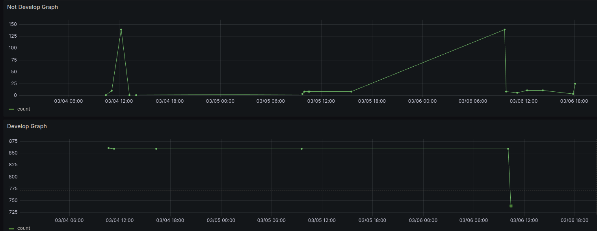

# Service for tracking new warnings when build C projects

Service accepts build log main branch, then create and store cache hash for all warnings strings\
Then accept the build log from the branch growing from the main one, find all warnings strings,\
calculate hash, find hash in cache and return new warnings to user\

Allows you to add fewer new warnings to the assembly when working with Legacy code,\
when it is not possible to suppress warnings in the assembly using the -Werror flag

# Example
Main branch build log
```log
faked.c:617:23: warning: format '%llx' expects argument of type 'long long unsigned int', but argument 3 has type 'long unsigned int' [-Wformat=]
     fprintf(f,"dev=%llx,ino=%llu,mode=%llo,uid=%llu,gid=%llu,nlink=%llu,rdev=%llu\n",
                    ~~~^
                    %lx
             (uint64_t) i->buf.dev,(uint64_t) i->buf.ino,(uint64_t) i->buf.mode,
             ~~~~~~~~~~~~~~~~~~~~~
faked.c:617:32: warning: format '%llu' expects argument of type 'long long unsigned int', but argument 4 has type 'long unsigned int' [-Wformat=]
     fprintf(f,"dev=%llx,ino=%llu,mode=%llo,uid=%llu,gid=%llu,nlink=%llu,rdev=%llu\n",
                             ~~~^
                             %lu
             (uint64_t) i->buf.dev,(uint64_t) i->buf.ino,(uint64_t) i->buf.mode,
                                   ~~~~~~~~~~~~~~~~~~~~~
faked.c:617:42: warning: format '%llo' expects argument of type 'long long unsigned int', but argument 5 has type 'long unsigned int' [-Wformat=]
     fprintf(f,"dev=%llx,ino=%llu,mode=%llo,uid=%llu,gid=%llu,nlink=%llu,rdev=%llu\n",
                                       ~~~^
                                       %lo
             (uint64_t) i->buf.dev,(uint64_t) i->buf.ino,(uint64_t) i->buf.mode,
                                                         ~~~~~~~~~~~~~~~~~~~~~~
faked.c:617:51: warning: format '%llu' expects argument of type 'long long unsigned int', but argument 6 has type 'long unsigned int' [-Wformat=]
     fprintf(f,"dev=%llx,ino=%llu,mode=%llo,uid=%llu,gid=%llu,nlink=%llu,rdev=%llu\n",
                                                ~~~^
                                                %lu
faked.c:619:13:
             (uint64_t) i->buf.uid,(uint64_t) i->buf.gid,(uint64_t) i->buf.nlink,
             ~~~~~~~~~~~~~~~~~~~~~                  
faked.c:617:60: warning: format '%llu' expects argument of type 'long long unsigned int', but argument 7 has type 'long unsigned int' [-Wformat=]
     fprintf(f,"dev=%llx,ino=%llu,mode=%llo,uid=%llu,gid=%llu,nlink=%llu,rdev=%llu\n",
                                                         ~~~^
                                                         %lu
```
Warnings in main branch
```json
{
	"id": "12c9c54c-f733-4eeb-9ce0-da6c7dd741eb",
	"count": 5,
	"newWarningList": [
		"faked.c:617:60: warning: format '%llu' expects argument of type 'long long unsigned int', but argument 7 has type 'long unsigned int' [-Wformat=]",
		"faked.c:617:23: warning: format '%llx' expects argument of type 'long long unsigned int', but argument 3 has type 'long unsigned int' [-Wformat=]",
		"faked.c:617:32: warning: format '%llu' expects argument of type 'long long unsigned int', but argument 4 has type 'long unsigned int' [-Wformat=]",
		"faked.c:617:42: warning: format '%llo' expects argument of type 'long long unsigned int', but argument 5 has type 'long unsigned int' [-Wformat=]",
		"faked.c:617:51: warning: format '%llu' expects argument of type 'long long unsigned int', but argument 6 has type 'long unsigned int' [-Wformat=]"
	]
}
```

Not main branch build log
```log
faked.c: In function 'save_database':
faked.c:617:23: warning: format '%llx' expects argument of type 'long long unsigned int', but argument 3 has type 'long unsigned int' [-Wformat=]
     fprintf(f,"dev=%llx,ino=%llu,mode=%llo,uid=%llu,gid=%llu,nlink=%llu,rdev=%llu\n",
                    ~~~^
                    %lx
             (uint64_t) i->buf.dev,(uint64_t) i->buf.ino,(uint64_t) i->buf.mode,
             ~~~~~~~~~~~~~~~~~~~~~
faked.c:617:32: warning: format '%llu' expects argument of type 'long long unsigned int', but argument 4 has type 'long unsigned int' [-Wformat=]
     fprintf(f,"dev=%llx,ino=%llu,mode=%llo,uid=%llu,gid=%llu,nlink=%llu,rdev=%llu\n",
                             ~~~^
                             %lu
             (uint64_t) i->buf.dev,(uint64_t) i->buf.ino,(uint64_t) i->buf.mode,
                                   ~~~~~~~~~~~~~~~~~~~~~
faked.c:617:42: warning: format '%llo' expects argument of type 'long long unsigned int', but argument 5 has type 'long unsigned int' [-Wformat=]
     fprintf(f,"dev=%llx,ino=%llu,mode=%llo,uid=%llu,gid=%llu,nlink=%llu,rdev=%llu\n",
                                       ~~~^
                                       %lo
             (uint64_t) i->buf.dev,(uint64_t) i->buf.ino,(uint64_t) i->buf.mode,
                                                         ~~~~~~~~~~~~~~~~~~~~~~
faked.c:617:51: warning: format '%llu' expects argument of type 'long long unsigned int', but argument 6 has type 'long unsigned int' [-Wformat=]
     fprintf(f,"dev=%llx,ino=%llu,mode=%llo,uid=%llu,gid=%llu,nlink=%llu,rdev=%llu\n",
                                                ~~~^
                                                %lu
faked.c:619:13:
             (uint64_t) i->buf.uid,(uint64_t) i->buf.gid,(uint64_t) i->buf.nlink,
             ~~~~~~~~~~~~~~~~~~~~~                  
faked.c:617:60: warning: format '%llu' expects argument of type 'long long unsigned int', but argument 7 has type 'long unsigned int' [-Wformat=]
     fprintf(f,"dev=%llx,ino=%llu,mode=%llo,uid=%llu,gid=%llu,nlink=%llu,rdev=%llu\n",
                                                         ~~~^
                                                         %lu
faked.c:619:35:
             (uint64_t) i->buf.uid,(uint64_t) i->buf.gid,(uint64_t) i->buf.nlink,
                                   ~~~~~~~~~~~~~~~~~~~~~     
faked.c:617:71: warning: format '%llu' expects argument of type 'long long unsigned int', but argument 8 has type 'long unsigned int' [-Wformat=]
     fprintf(f,"dev=%llx,ino=%llu,mode=%llo,uid=%llu,gid=%llu,nlink=%llu,rdev=%llu\n",
                                                                    ~~~^
                                                                    %lu
faked.c:619:57:
             (uint64_t) i->buf.uid,(uint64_t) i->buf.gid,(uint64_t) i->buf.nlink,
                                                         ~~~~~~~~~~~~~~~~~~~~~~~
faked.c:617:81: warning: format '%llu' expects argument of type 'long long unsigned int', but argument 9 has type 'long unsigned int' [-Wformat=]
     fprintf(f,"dev=%llx,ino=%llu,mode=%llo,uid=%llu,gid=%llu,nlink=%llu,rdev=%llu\n",
                                                                              ~~~^
                                                                              %lu
```
New warnings
```json
{
	"id": "ecaeb0c9-4c84-4f84-9190-95831d9f3049",
	"count": 2,
	"newWarningList": [
		"faked.c:617:71: warning: format '%llu' expects argument of type 'long long unsigned int', but argument 8 has type 'long unsigned int' [-Wformat=]",
		"faked.c:617:81: warning: format '%llu' expects argument of type 'long long unsigned int', but argument 9 has type 'long unsigned int' [-Wformat=]"
	]
}
```

# Curl requests

## Create record

```bash
curl --request POST \
  --url http://${SERVER_ADDRESS}:${SERVER_PORT}/v1/warning \
  --header 'Content-Type: multipart/form-data' \
  --header 'User-Agent: insomnia/8.5.1' \
  --form commit=beffe2b9a727c481c8a4896edb1783a054ac084c \
  --form branch=develop \
  --form build_log=@/path_to_test_file/testfile \
  --form created_by=Shabashkin \
  --form created_at=2023-12-06T20:07:41.137Z
```

## Get status

```bash
curl --request GET \
  --url http://${SERVER_ADDRESS}:${SERVER_PORT}/v1/status \
  --header 'User-Agent: insomnia/8.5.1'
```

Correct response example
```json
{
	"StatusDB": true,
	"Version": "v0.0.1",
	"BuildTime": "”2024.02.19.193420”",
	"CommitHash": "5edf4bb"
}
```

# Execute
## Example .env file
```.env
LOG_LEVEL=DEBUG
POSTGRES_USER=wtrack
POSTGRES_PASSWORD=wtrack
POSTGRES_DB=PG_DATABASE
POSTGRES_SCHEMA=warning_tracker
POSTGRES_PORT=5432
INTERNAL_POSTGRES_PORT=5432
POSTGRES_SSL_MODE=disable
SERVER_PORT=8090
PROJECT_NAME=warning-tracker
ACCESS_TOKEN_LIFETIME=5
REDIS_ADDRESS=0.0.0.0
REDIS_PASSWORD=admin
REDIS_PORT=6379
REDIS_BACKUP_TIME=60
GRAFANA_PORT=3000
PROMETHEUS_PORT=19090
TZ=Asia/Yekaterinburg

```

## Preparation
### Install migrate util and create needs postgresql structs
```bash
make migrate-install
docker-compose up -d db
make migrate-up
docker stop warning-tracker-postgres
```

## Start Services
### From sources
#### Run
```bash
make up
```
#### Stop
```bash
make down
```

### Metrics
#### Start
```bash
metrics-up
```
#### Stop
```bash
metrics-down
```

### From dockerhub image
### Run
```bash
make cache-up
make db-run
docker pull shabashkin/warning-tracker-server:latest
make backend-run
```

### Stop
```bash
backend-stop
make db-stop
make cache-down
```
# Example grafana
Up diff not main and main branch warnings count\
Down count warnings in develop branch
